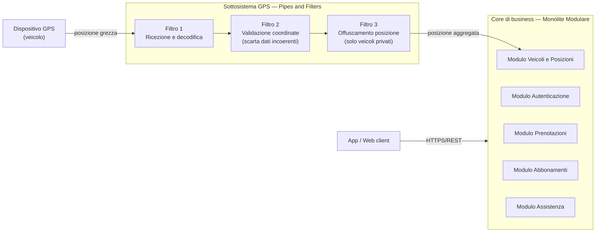

# Scheda Comparativa — Decisione Architetturale di Macro-Pattern

| Campo | Specifica |
| :--- | :--- |
| **Progetto** | EPIC-001 — Piattaforma di Car/Bike Sharing tra Privati con Flotta Aziendale |
| **Fase** | Design — Lab 05 (Decisione Architetturale di Macro-Pattern) |
| **Fonte metodologica** | UFS011 — Lezione 05, §3.B "Tassonomia dei Macro-Pattern Architetturali" |
| **Decisione** | **Monolite Modulare** (core di business) + **sottosistema Pipes and Filters** (elaborazione posizioni GPS) |
| **Stato** | Proposta |

---

## 1. Contesto della decisione

Dai documenti di analisi emergono due tipi di carico molto diversi:

1. **Carico transazionale richiesta/risposta.** Autenticazione, ricerca veicoli in mappa, prenotazione con verifica della finestra di 24 ore, addebito, abbonamenti, ticket (FEAT-01 → FEAT-06). Il prototipo validato (`getAvailableVehicles()`, `createBooking()`) segue esattamente questo schema.
2. **Flusso continuo di posizioni GPS.** Ogni veicolo, di flotta o privato, monta un dispositivo GPS fornito dalla società (EPIC-001, Dipendenze esterne). La posizione va mostrata in mappa **"in forma aggregata, senza esporre la posizione precisa in tempo reale del proprietario privato"** (FEAT-02, Regola di business 2).

La Lezione 05 propone per casi di questo tipo un'**architettura ibrida**: un core strutturato a blocchi per il business, affiancato da un sottosistema a flussi o reattivo per la telemetria. La scheda confronta le opzioni per ciascuna delle due metà.

---

## 2. Confronto delle opzioni

### 2.1 Core di business: Monolite Modulare vs Microservizi essenziali

| Criterio | Monolite Modulare | Microservizi essenziali |
| :--- | :--- | :--- |
| **Unità di rilascio** | Una sola, decomposta in moduli con interfacce esplicite | Una per servizio |
| **Consistenza dei dati** | Transazioni ACID su un unico database | Database-per-service, consistenza eventuale (Saga Pattern) |
| **Prevenzione doppie prenotazioni** | Lock/vincoli nella stessa transazione | Coordinamento distribuito tra servizi |
| **Complessità operativa** | Bassa | Alta (DevOps, networking, distributed tracing) |
| **Scalabilità** | Verticale o per repliche dell'intera applicazione | Indipendente per singolo servizio |
| **Adeguatezza all'MVP 1.0** | ✅ Alta | ⚠️ Sovradimensionata |

### 2.2 Sottosistema posizioni GPS: Event-Driven vs Pipes and Filters

| Criterio | Event-Driven Architecture | Pipes and Filters |
| :--- | :--- | :--- |
| **Forma dell'elaborazione** | Eventi pubblicati su un broker e consumati da N consumer indipendenti | Sequenza lineare di trasformazioni atomiche |
| **Natura del problema GPS** | Utile se molti consumer reagiscono allo stesso evento | ✅ Il dato passa per passi ordinati: ricezione → validazione → offuscamento → aggiornamento |
| **Infrastruttura richiesta** | Broker dedicato (Kafka, RabbitMQ, Redis Pub/Sub) | Canali semplici tra filtri (anche in-process o una coda leggera) |
| **Testabilità** | Richiede di simulare broker e consumer | Ogni filtro si testa in isolamento (input → output) |
| **Caso d'uso citato nella Lez. 05** | Eventi di dominio (`VeicoloSbloccato`, `BatteriaBassaRilevata`) | "Pipeline di elaborazione telemetrica IoT" |
| **Adeguatezza al progetto** | ⚠️ Evoluzione futura | ✅ Alta |

---

## 3. Architettura scelta

---

## 4. Vantaggi sistemici della combinazione

### V1 — Ogni metà del sistema usa il modello di consistenza di cui ha bisogno
Il Monolite Modulare tiene prenotazioni, pagamenti e stato dei veicoli in **un unico database transazionale (ACID)**. Questo è il modo più semplice e affidabile per rispettare il vincolo *"assenza di doppie prenotazioni concorrenti sullo stesso veicolo"* (FEAT-02, criteri di accettazione; EPIC-001, rischi tecnici). La pipeline GPS invece lavora su dati che si rinnovano di continuo, dove conta l'ultima posizione e non la singola transazione. Separare le due metà evita di imporre la rigidità transazionale al flusso GPS e, al contrario, evita la consistenza eventuale distribuita (Saga Pattern) sul core delle prenotazioni.

### V2 — Privacy by design come stadio dedicato e verificabile della pipeline
Il requisito di non esporre la posizione precisa dei veicoli privati (FEAT-02, Regola 2; EPIC-001, rischi di compliance) diventa **un filtro autonomo** (Filtro 3), attraversato obbligatoriamente da ogni posizione prima di raggiungere il core. Di conseguenza il core e la mappa **non ricevono mai** la posizione esatta di un privato. Il filtro si può testare in isolamento (posizione esatta in ingresso → posizione aggregata in uscita) e il controllo è documentabile in sede di audit GDPR.

### V3 — Isolamento del carico ed estendibilità senza toccare il core
Il flusso GPS arriva in modo continuo, indipendentemente dagli utenti, e il segnale può essere instabile in zone con copertura scarsa (EPIC-001, rischi tecnici). Con la pipeline separata, picchi o anomalie di questo flusso **non rallentano** la mappa e la conferma di prenotazione, che devono rispondere *"senza percettibile attesa"* (FEAT-02, Performance). La pipeline si estende aggiungendo nuovi filtri (per esempio il rilevamento di anomalie per la segnalazione di emergenza in corsa, FEAT-06 / US13) senza modificare il monolite. A sua volta il monolite, grazie ai moduli con interfacce esplicite, conserva un percorso di migrazione graduale verso i microservizi se in futuro un modulo dovesse scalare da solo.

---

## 5. Trade-off operativi

### T1 — Due unità di esecuzione invece di una
Rispetto a un monolite puro, il sistema ha **due componenti da rilasciare, configurare e monitorare**: l'applicazione di business e il worker della pipeline GPS. In più c'è un canale di comunicazione tra i due da mantenere affidabile. Se la pipeline si ferma, la mappa continua a funzionare ma mostra posizioni non aggiornate, quindi serve un monitoraggio specifico per accorgersene.
**Mitigazione:** health-check del worker e indicazione in mappa dell'ultimo aggiornamento della posizione.

### T2 — Latenza e rigidità del flusso lineare
In una pipeline ogni posizione deve attraversare **tutti i filtri in sequenza**: la posizione in mappa arriva sempre con un piccolo ritardo, e il filtro più lento determina la velocità dell'intera catena. Inoltre il flusso è **unidirezionale e lineare**. Se in futuro più parti del sistema dovranno reagire allo stesso dato GPS in parallelo (notifiche, analisi, assistenza), Pipes and Filters diventa meno adatto e conviene evolvere verso un modello Event-Driven con broker.
**Mitigazione:** filtri semplici e senza stato. Il ritardo è accettabile perché il requisito chiede una posizione *aggregata*, non in tempo reale.

---

## 6. Sintesi della decisione

> Si adotta un'architettura **ibrida**: **Monolite Modulare** per il core transazionale (autenticazione, veicoli, prenotazioni, abbonamenti, assistenza) e **sottosistema Pipes and Filters** per la ricezione, la validazione e l'offuscamento delle posizioni GPS. La scelta privilegia semplicità operativa e consistenza forte dove servono (prenotazioni e pagamenti), e isola in una pipeline testabile il flusso GPS e il vincolo di privacy sui veicoli privati. L'Event-Driven Architecture resta l'evoluzione prevista se il numero di consumer del dato GPS dovesse crescere.
